# Skill is all you need：Noumena在构建营销Agent时遇到的经验和教训

> [!TIP]
> Noumena打造了一个AI原生的"智能增长（Growth Intelligence）"系统，用AI提升商业种草和转化中的确定性，帮助品牌重塑增长。

## Part 1: 问题背景

### 1.1 Workflow 开始失效

在 Agent 工程化的早期阶段，一个绕不开的工程选择是：是否通过画布工具将任务拆解为一组固定流程，还是放弃强约束的流程控制，让模型在更开放的执行空间中自行完成任务。

以 n8n、Dify 为代表的画布式 Workflow，在确定性强的问题上非常有效。当业务逻辑是线性的，步骤和输入输出边界清晰，流程几乎不会随场景变化时，用流程图来描述任务是最直接、也最稳定的方式。像固定模板的报表生成、标准化数据清洗，这类问题可以通过少量高价值流程长期复用，工程重点放在稳定性和可控性上。

<figure style="text-align: center;">
  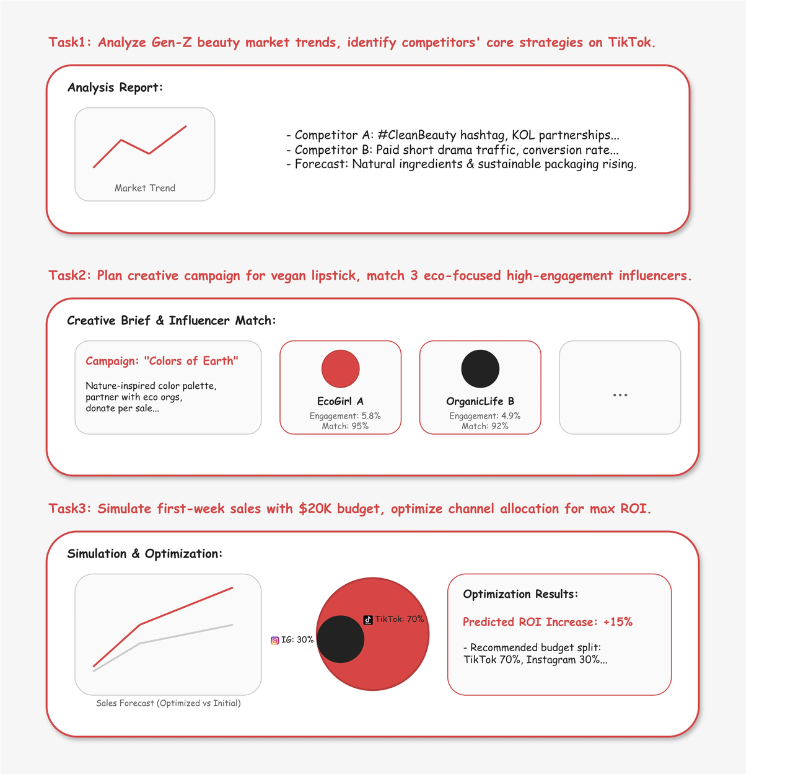
  <figcaption style="margin-top: 8px; color: #666; font-style: italic; font-size: 0.9em;">
    典型的社交媒体营销任务
  </figcaption>
</figure>

但营销领域中的问题，很难被抽象为一条可以长期稳定运行的固定流程。这里的困难并不在于步骤是否复杂，而在于决策严重依赖实时上下文，而这些上下文本身在不断变化。

面对同一份千万播放量的网红结案数据，不同角色的结论往往互斥。CMO看到的是品牌声量的扩张，决定追加预算；内容运营盯着前 3 秒的高流失率，急于优化脚本钩子；而一线投放手只看到极高的点击成本，将其判定为无效投放。同一个数据点，在决策层看来是品牌资产，在执行层却是流量浪费，单一的线性流程无法兼容这种本质上的决策分歧。

营销领域“好”的标准从不是一成不变的。在新产品刚上线时，为了测试市场，高昂的获客成本不仅被接受，甚至被视为必要的“学费”；但如果同样的成本出现在稳定期，就是必须立刻叫停的事故。热点变化更快：周一还能带来转化的网络梗，周五可能就已经过气，甚至让品牌显得尴尬。试图用一套写死的规则去抓住这些时刻变动的目标，注定会失败。

不同行业的营销逻辑天差地别，经验很难照搬。卖口红靠的是视觉刺激和网红带货带来的冲动消费，如果把这套打法强行搬去卖理财或教育产品，只会是一场灾难——因为后者需要的是长期的信任建立和严格合规。同样的，大品牌为了维护形象往往小心翼翼，这与初创公司为了生存必须采取的激进策略完全不同，不存在一套能通吃所有生意的标准说明书。

这些特性直接放大了传统 Workflow 的结构性限制。Workflow 需要问题可以被枚举，判断节点可以通过反馈快速验证和调优，但营销中的大量决策依赖创意与经验，结果往往难以即时验证。执行反馈链路长，归因噪声大，使得流程中的条件判断缺乏稳定的校验基础，调优成本随着复杂度迅速上升。

当流程无法被持续验证时，维护问题开始显现。为了覆盖更多场景，流程不断分叉、规则持续叠加，但可泛化性并未同步提升，系统反而变得难以理解和维护。我们最终意识到，营销问题并不适合被长期固化为固定流程，系统需要在目标层面保持弹性，在必要约束下允许动态决策，而不是假设存在一条可稳定复用的最优路径。

### 1.2 Marketing Template的静态上下文缺陷

为了解决营销问题难以泛化的问题，我们在早期尝试中引入了 file system as memory 的思路，希望通过文件系统来承载和复用专家经验，由此设计了一套用于营销 Agent 的模板化目录结构。

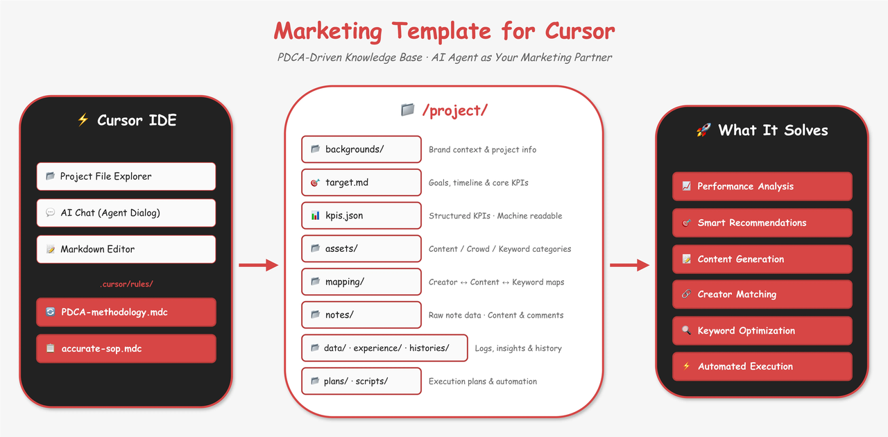

在代码开发场景中，Cursor 允许通过 mdc 文件为项目定义一组长期生效的规则。这些规则在 Agent 运行时会作为上下文被加载，用来约束模型的行为和输出风格。我们将这一机制视作一种可控的上下文注入方式，并尝试用它来承载营销领域的业务逻辑，而不仅仅是代码规范。

我们构建了一套相对结构完整的目录结构，将数据、工具、流程、经验分开进行存储。每种流程SOP我们均构建一个mdc文件，并设计一套基于用户query的触发规则。与传统workflow不同的是，我们在mdc里仅会指导agent，每一步的思考方式和可用的工具列表，实际的执行依然交给agent本身判断。这会有两个好处：

**Methodology > Process：** 我们在 .mdc 中注入的是**专家的方法论和思考模式**。我们告诉 Agent：“在分析 ROI 下降时，你应该先看大盘还是先看素材”、“由于你只有 A/B/C 三个工具，你应该如何组合使用它们”。

**自主裁决：** 我们只提供“思考的地图”和“工具箱”，至于具体先迈哪条腿、每一步怎么走，**实际的执行判断依然完全交给 Agent 本身**。

以下图为例，我们尝试在marketing template中提问："对我的投放结果进行深度分析并复盘"。marketing template能够通过调用我们提供的上下文和工具，进行一个很全面的复盘报告，并给出多种维度的分析结论：

<figure style="text-align: center;">
  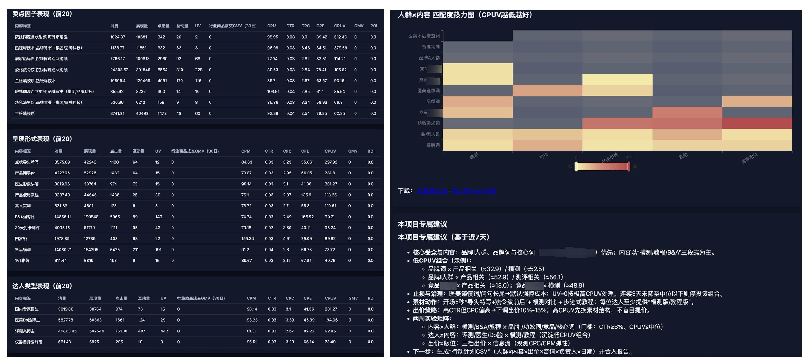
  <figcaption style="margin-top: 8px; color: #666; font-style: italic; font-size: 0.9em;">
    Marketing Template投放复盘结果展示
  </figcaption>
</figure>

但很快我们也遇到了明显的瓶颈。mdc 本质上是一份静态上下文，一旦被加载，其中的判断假设就默认长期成立。随着行业、投放阶段和业务规模的变化，同一套模板很难持续适用。模板越丰富，触发规则越复杂，Agent 对上下文的依赖反而越重，适应变化的能力开始下降。

我们意识到，用静态模板来承载动态问题，本身就存在结构性限制。它缓解了流程过死的问题，但并没有真正解决营销场景中随时变化的决策环境。后续的设计需要让系统本身具备更新和调整上下文的能力，而不是只在执行前一次性注入。

### 1.3 从Template到Skill

当 Anthropic 推出 Claude Skills 机制时，这套设计在架构层面恰好对应了我们正在面对的限制。

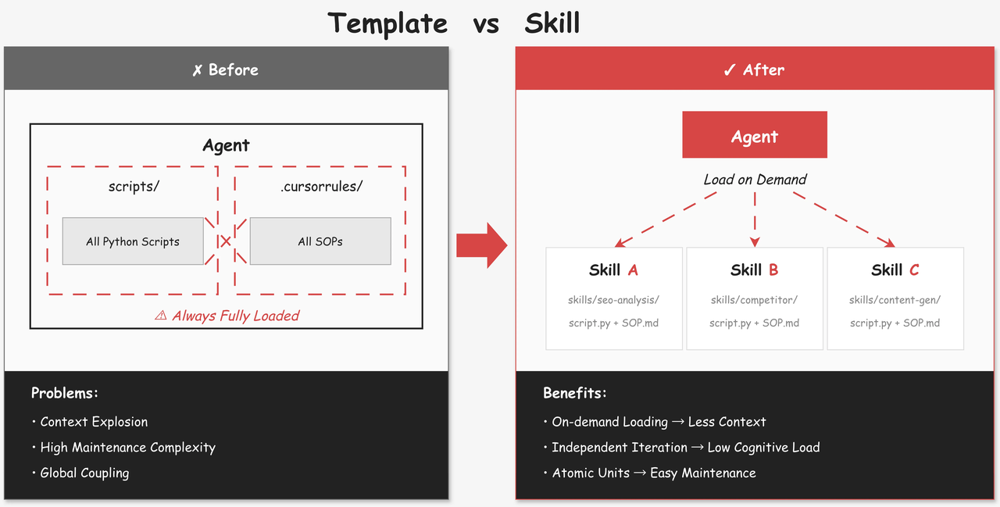

Skill 的核心变化在于能力的加载方式从静态变为运行时按需加载。每一个 Skill 都只负责解决一类明确的问题，只有当 Agent 在执行过程中判断需要该能力时，对应的 Skill 才会被引入上下文。这样，系统不再需要在一开始就携带所有可能用到的规则和经验，而是随着决策逐步展开，显著缓解了上下文长度带来的压力。

由于Skill 以独立文件夹的形式存在，使得复杂逻辑可以自然拆分。与早期集中式的 scripts 和全局规则不同，每一个 Skill 都封装了解决特定问题所需的工具说明、思考约束和执行辅助。这种拆分方式让复杂系统逐步演化为一组可组合的能力单元，而不是一个不断膨胀的整体。

这种模块化设计直接改变了系统的维护方式。修改某个 Skill 时，只需要关注其自身行为和边界，不再需要对全局流程保持完整认知。对于参与迭代的业务专家而言，也无需理解整个 Agent 架构，就可以围绕具体问题持续沉淀经验，使能力更新成为一种局部、可控的工程行为。

## Part 2: 核心架构

### 2.1 Anthropic 的生态视角分层

在构建 Skill 体系时，我们首先参考了 Anthropic 的官方定义。在其最新的分享[《Don't Build Agents, Build Skills Instead》](https://www.youtube.com/watch?v=CEvIs9y1uog)中，Skill 主要依据**来源**和**通用性**进行分层：

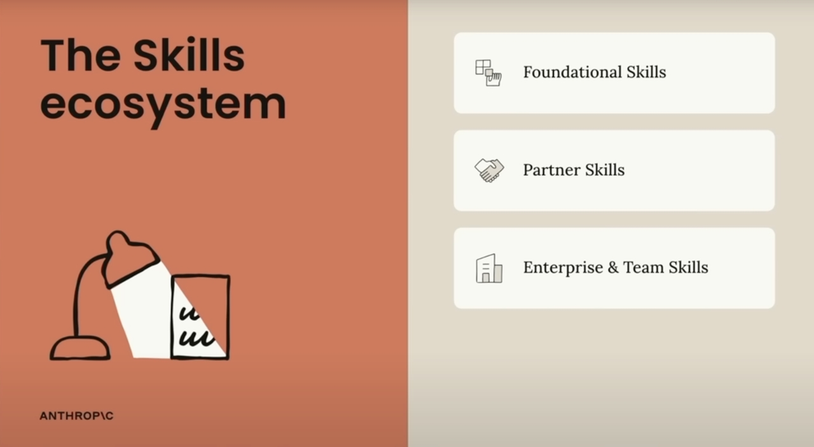

**Foundational Skills：** 由官方或核心团队提供，赋予 Agent 通用的新能力（如文档处理、代码执行） 。

**3rd Party Skills：** 由生态合作伙伴构建，用于连接外部 SaaS 工具（如 Notion 的工作区搜索、Browserbase 的浏览器自动化）。

**Enterprise Skills：** 企业内部构建的特定流程，用于教 Agent 学习组织内部的最佳实践和特定业务逻辑。

这套分层明确了不同 Skill 的建设主体和职责划分，使通用能力、生态能力和私有能力可以各自独立演进。但从工程实践来看，这种分层更多解决的是能力来源的问题，并未覆盖业务逻辑。在复杂任务中，仅仅拥有一组可用 Skill 并不足以完成目标，Agent 仍需要在运行过程中判断何时调用哪些能力，以及如何在多次调用之间组织推理和状态。

基于这一观察，我们在来源分层之上，引入了一层面向决策的结构，用来约束和引导 Skill 的组合与调用方式。

### 2.2 Noumena 的认知视角分层

正如前文所述，营销场景中要面对上下游不同职能角色的多种长尾问题。比如对于产出品牌洞察报告，每个品牌策划都可能有若干种不同的解法。为了让 Agent 能够处理非线性、上下文高度变化的复杂任务，我们从 Agent 在执行任务时的决策过程出发，重新对系统结构进行分层：负责运行环境和状态管理的 **OS Agent**，提供确定性执行能力的 **Atomic Skill**，以及承担任务拆解和路径选择的 **Thinkflow Skill**。

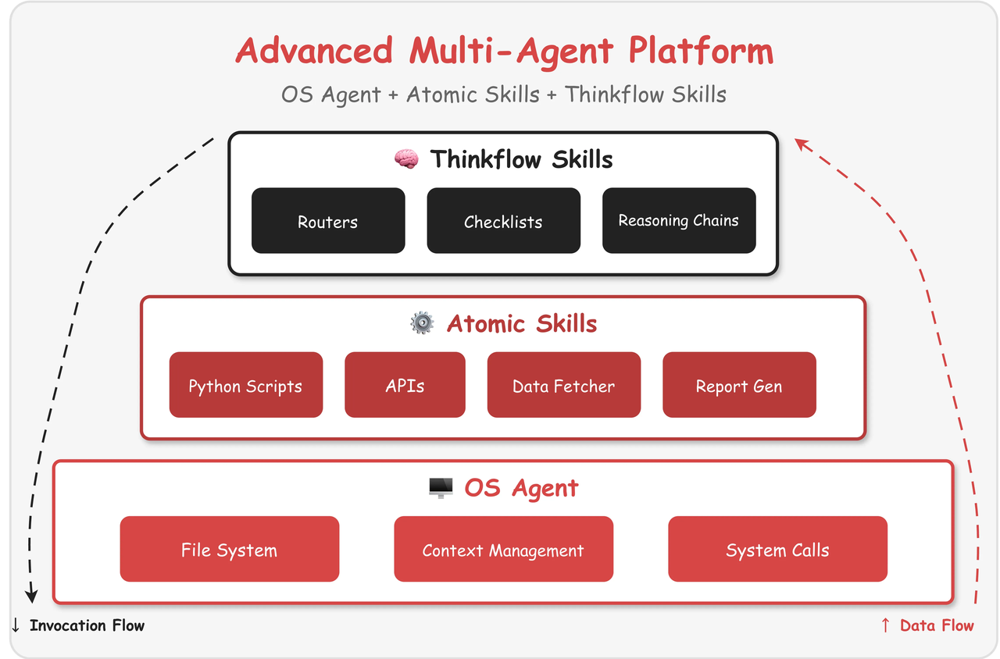

最底层是 OS Agent，它的职责并不是执行业务逻辑，而是为整个 Agent 系统提供稳定的运行环境和系统调用。OS Agent 管理命令行工具、脚本解释器以及文件读写接口，同时维护一个结构化的工作区。任务的中间结果和执行产物会尽可能以文件的形式落在这个工作目录中。这样设计的直接好处是将大量状态从上下文中卸载到文件系统中，降低了上下文长度对性能的影响，同时也让任务在中断后具备可恢复性。对 Agent 来说，当前任务的工作记忆并不依赖一次性注入的长上下文，而是持续维护在可读写的文件结构中。

在 OS Agent 之上是 Atomic Skill 层，该层聚焦于提供行为确定、边界清晰的基础执行能力。Atomic Skill 通常会实现若干输入参数明确、输出结构稳定的代码脚本，它们不参与复杂决策，也不感知业务上下文，只负责完成单一、可验证的动作。例如数据获取、内容处理、结构化写入等操作，都被封装为独立的 Atomic Skill。该层充当的是 Agent 的执行单元，保证底层动作的稳定性，使上层推理不必反复处理执行细节的不确定性。

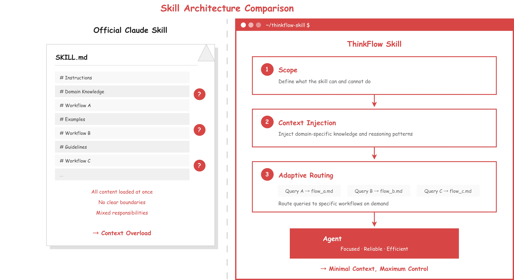

真正承担复杂性的，是最上层的 Thinkflow Skill。Thinkflow 并不是一个简单的流程脚本，而是对专家思考方式的结构化表达。它负责将一个高层目标拆解为若干阶段性判断，并在运行过程中根据当前上下文决定调用哪些 Atomic Skill，以及如何评估阶段性结果。当 Agent 加载一个 Thinkflow 时，首先会读取该 Skill 对自身能力范围和前置条件的说明，对当前上下文进行检查。如果必要信息缺失，系统会暂停执行并回溯获取缺失输入。在上下文满足的前提下，Thinkflow 会根据用户意图和任务侧重点的差异，动态选择不同的分析路径，而不是沿着一条预先固定的流程向前推进。

认知分层设计缓解了传统 Workflow 在设计阶段就固化路径的问题。Atomic Skill 提供的是稳定可复用的执行能力，而 Thinkflow 决定的是在什么情况下以什么顺序组合这些能力。路径选择发生在运行时，而不是设计时，使 Agent 能够在约束之内根据上下文变化调整决策方式，更接近专家在真实工作中的问题处理方式。

## Part 3: Thinkflow 作为认知路由器与数据连接器

回归架构本质。Thinkflow 不仅仅是存储逻辑的文件，更是连接用户意图与底层能力的核心中间层。它负责治理上下文并连接一切资源——无论是代码片段、业务数据，还是用户记忆。

### 3.1 SKILL.md as Router

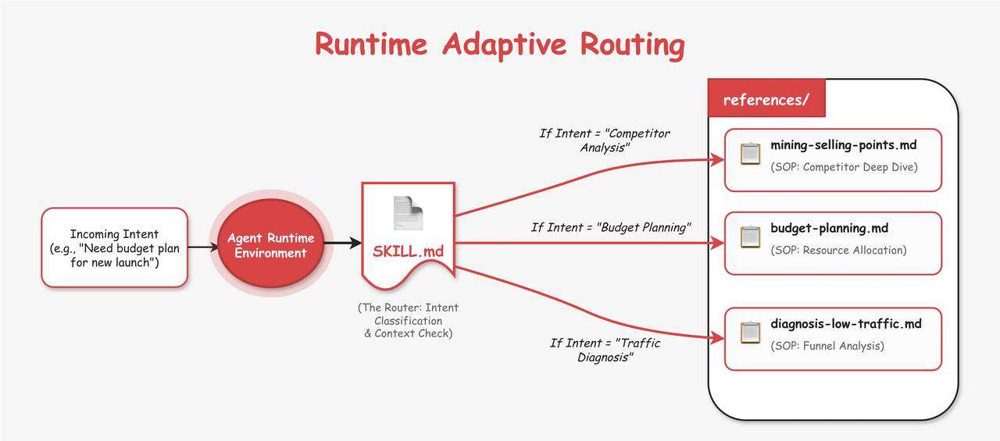

在 Anthropic 的原始定义中，Skill 更接近于一份被动的使用说明。当问题复杂度提升时，这种形式容易出现两个极端结果：一是因缺乏明确规范而导致行为不稳定，二是为了覆盖更多情况而引入过多上下文，进而影响性能。因此我们将 Thinkflow Skill 设计为一种更强约束的结构，并让 SKILL.md 承担路由网关，通过三个核心维度，在保持Agent自由度的前提下，将发散的思维收敛：

**Scope：** 在thinkflow skill的SKILL.md最开始，我们明确定义了该Skill 的边界，防止模型幻觉。例如，“本 Skill 仅负责新品上市阶段的预算拆解，不负责具体的广告投放操作”。这让 Agent 清楚知道自己“能做什么，不能做什么”。

**Knowledge Injection：** 在能力边界之后，我们会写入在这个领域中特定的背景知识，保证模型能理解之后出现的各种专业名词和知识，以及这个领域的专家通常思考问题的逻辑方式。

**Adaptive Routing：** 在背景知识之后，我们会列举若干用户常问的query类型，每一种query会被路由到references/中的一个thinkflow.md文件中，详细的流程不会在SKILL.md中展开。基于这种模式，无用的流程不会被一次性注入到模型的上下文中。

### 3.2 References as SOP

如果说 SKILL.md 负责决定走哪条路，那么 references 中的文件则定义了路应该怎么走。这里的目标不是描述抽象的方法论，而是将专家在处理某一类问题时的隐性思维过程转化为可执行的 SOP。

每个references文件包含以下三个核心结构：

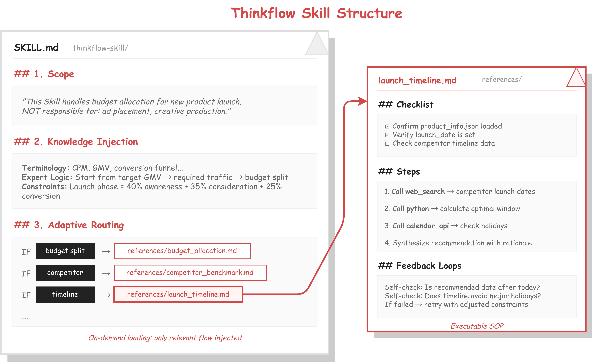

**Checklist：** Agent在执行前要制定的每一步checklist。例如：“确认已读取 campaign_data.csv，且数据包含昨日的消耗字段。”

**Steps：** 这是具体的执行步骤，也是 Thinkflow 调用底层能力的接口。我们允许每一步skill调用其他skill，以复用其他skill的能力。例如：

_Step 1:_ 调用 web_deep_research (Atomic Skill) 查看竞品近期的文章信息。

_Step 2:_ 调用 python (Atomic Skill) 计算这些笔记的互动率均值。

_Step 3:_ 结合上下文生成分析结论。

**Feedback Loops：** 定义自我反思机制，用于校验结果的逻辑自洽性。例如：“检查计算出的互动总数，是否等于点赞+收藏+评论之和？如果不等，请重新检查 Python 代码。”

### 3.3 数据、工具与记忆的统一入口

Thinkflow 天然适合作为能力和数据的连接器。读取数据库、调用脚本、写入记忆本质上都是同一类动作的不同实例，Thinkflow 本身并不实现这些能力，而是通过自然语言指令在合适的时机调度底层的工具或 Skill，由 Agent 自行完成参数抽取和调用决策。例如：

你可以在step1中提示模型要基于用户的query调用**JTBD_KG**工具获取我们维护的图谱数据

也可以在step3中让模型总结step1和step2的结果，抽象参数并调用gen_image接口

这种模式使工具抽象得以统一，流程编排不再依赖大量显式编码，而是由 Thinkflow 在运行时完成。同时，由于 Thinkflow 的执行路径是逐步展开的，相关上下文也会随之按需加载，有效避免了信息一次性注入带来的上下文膨胀问题。

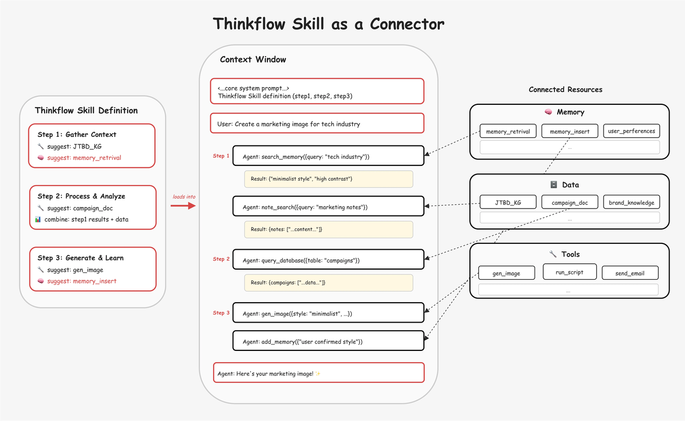

在这一结构下，记忆的使用也变得更加自然。通过标准化的记忆写入和检索能力，Thinkflow 可以在执行过程中主动回收历史经验，并在获得用户反馈后持续更新记忆。在实际业务中，即便面对相同的流程，不同用户对结果的偏好也可能完全相反。基于 Skill 级别的记忆管理，Agent 可以在维持流程一致的同时，输出更符合用户个人偏好的结果。例如：

在调用脚本之前，你可以先检索有关【用户query所处行业的相关memory】，帮助你认识这个行业

在用户给你反馈之后，如果你对用户的审稿风格有新的认识，请更新到memory中

在过去的实际业务场景中，我们遇到了大量的同一业务流程下，对结果的反馈截然相反的情况。而上面描述的skill based memory为我们提供了一种全新的解题方向，在同样的业务流程下，我们也可以通过维护不同的用户memory，得到完全不同但更契合用户偏好的业务结果。

## Part 4: Lessons to Learn

### 4.1 Limitations

在实际落地 Skill Agent 的过程中，我们逐步识别出这套架构仍然存在一些不可忽视的限制。这些问题并非实现细节层面的缺陷，而更多来自模型能力边界、本身架构复杂度以及对底层框架的依赖方式。

**嵌套深度限制**：通过实测我们发现，Skill 之间的调用层级不宜超过三层。一旦链路过长（例如 Thinkflow 调用 Thinkflow 再调用 Atomic），模型在回溯顶层目标时极易出现"认知断片"，导致任务在中途迷失。

<figure style="text-align: center;">
  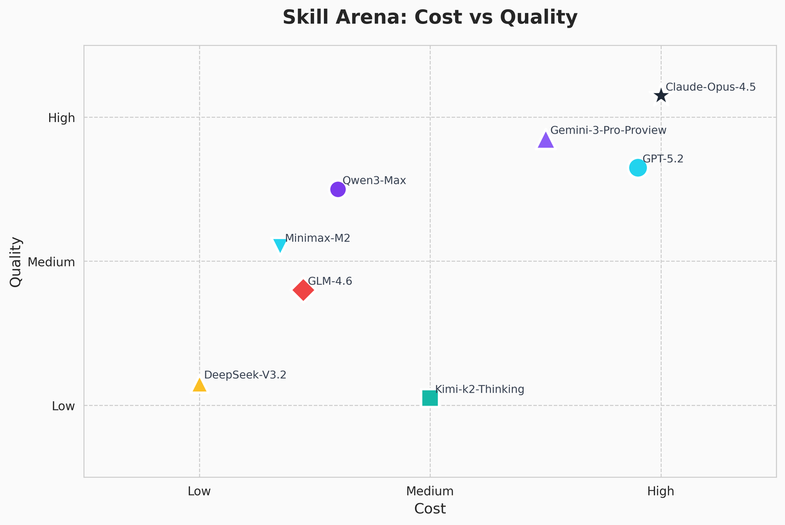
  <figcaption style="margin-top: 8px; color: #666; font-style: italic; font-size: 0.9em;">
    多Skill协同场景下不同模型的质量与开销对比
  </figcaption>
</figure>

**模型成本vs性能**：更现实的约束来自模型成本与执行质量之间的权衡。在当前模型能力分布下，推理质量和调用成本呈现出相关性，尚不存在既低成本又能稳定支撑复杂 Skill 编排的模型选项。在复杂 Thinkflow 场景下，如果为了控制成本而使用推理能力较弱的模型，容易出现调用失败、结构化输出不稳定等问题。因此在实际设计Skill 架构时，必须在业务稳定性和长期运行成本之间持续权衡，而无法简单依赖架构本身解决。

**框架依赖风险：** 目前这套体系高度依赖 Claude Agent SDK。高层抽象在早期显著降低了实现成本，但也引入了可观的调试和可控性问题。例如：当一个 Skill 无法正确触发，或者分发路由失效时，由于中间件逻辑被封装在 SDK 内部，开发者很难通过传统的 Debug 手段定位问题。

这些限制意味着，Skill 架构并不是一套可以无脑扩展的通用解法。它在带来结构弹性的同时，也需要新的工程约束，并在Skill 设计粒度、模型选型以及底层框架持续尝试和调整。

### 4.2 Experience of Building Skills

在实现我们的Agent的过程中，我们也总结了一些有利于提升Agent能力的经验。

**如非必要，勿用临时代码：** 在Atomic Skill的设计初期，我们的scripts往往设计的不够鲁棒和强大。因此模型在实际场景中，不得不根据需求编写大量的临时 Python 代码。但很快，我们发现模型的幻觉率出现了显著提升。我们认为主要的原因有两个：

**上下文的异常挤占** ：模型生成的每一行代码及其运行后的结果，都在占用主Agent的context，这种无关信息的快速堆积会导致明显的“注意力稀释”。

**本应由Skill处理的流程被错误处理，导致幻觉累积：**在生产环境中，我们的许多 Skill 依赖中间件来构建，比如数据标注、多模态理解、或是特定的筛选和处理。如果模型试图用一段临时的 Python 代码，基于规则去处理文件，它实际上**绕过了系统预设的增强逻辑**。这种“走捷径”的行为会导致该节点的幻觉率飙升，并传递给后续步骤，层层累积引发连锁反应，到最后用户自己都很难判断模型究竟从哪里开始发生了幻觉。

**优化的关键是数据治理：** 我们发现很多用户希望Agent能帮助他们处理混乱的原始数据。但实际上，Agent输出的结果质量往往和它能获取到的数据质量高度相关。

例如，用户往往会提供给模型大量的原始广告素材，希望Agent能自动找到很深刻的洞察和机会点。但事实上，在这种数据下，模型往往只能得到平庸的结论。为了解决这种问题，我们花了大量的精力，对用户的原始数据做数据治理，并设计了多种加速治理的工具，以帮助模型发现隐藏在数据背后真正的价值。

**使用Skill DevOps进行低成本迭代：** 架构只是容器，内容才是灵魂。在实际落地时，我们还要解决一个挑战：**如何让不懂代码的业务专家，也能自主构建并迭代高质量的 Skill？** 因此我们基于TDD（测试驱动开发）的思想，将 Agent 的能力视为可测试、可观测的工程制品，建立了 **Skill DevOps** 体系，并实现了两个关键 Agent ：**Skill Builder** 和 **Skill Evolver**。

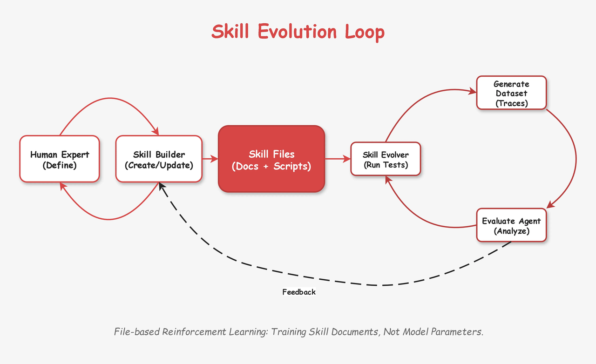

**Skill Builder** 负责解决"从无到有"的问题。它通过多轮对话引导专家提取业务逻辑，利用内置脚本将零散的自然语言抽象为包含 meta.json、SKILL.md 和代码框架的标准化文件结构。

**Skill Evolver** 则负责“从有到优”的闭环。专家只需提供解题思路（包含Query、Answer、Reasoning），Evolver 便会自动将其转化为结构化的评分细则（Rubrics）。随后，它会启动“执行-诊断-修复”的循环：通过独立实例运行测试，对“工具误用”、“代码错误”或“逻辑冲突”进行深度归因，并自主尝试修复 Skill 文件中的描述或代码。

这种分工的本质是构建了一套**基于文件的强化学习闭环**。业务专家充当“奖励模型”（Reward Model）定义标准，而 Builder 和 Evolver 充当“策略优化器”（Policy Optimizer）不断修正 Skill 文件。这使得企业能够以零模型训练成本，实现业务能力的持续进化。我们将在后续的博客中介绍更多我们的实现细节。

## 结语：Less Workflows, More Skills

回顾我们在Agent工程化方面的实践，我们完成了一个从固定流程向模块化技能架构的转型。通过将执行逻辑、认知模型与系统基座解耦，这种架构解决了复杂业务场景下上下文冗余与推理不稳定的技术问题。目前，业务专家可以通过定义结构化的技能文件直接参与逻辑迭代，并利用自动化评估体系保证质量。这种模式不仅降低了技术与业务之间的沟通成本，更确保了业务逻辑在非确定性环境下的可执行性与可预测性。

我们认为未来Agent的工程重点将由模型参数转向对过程性知识的治理，产品的核心壁垒在于如何将专家思维转化为可复用、可验证的技能库，并建立与之配套的标准化数据底座。随着模型能力的演进，工程挑战将集中在复杂技能的动态调度与多源资源的连接效率上。只有通过体系化的技能建设与数据治理，Agent才能真正进入业务核心场景并产生实际收益。